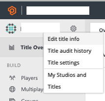
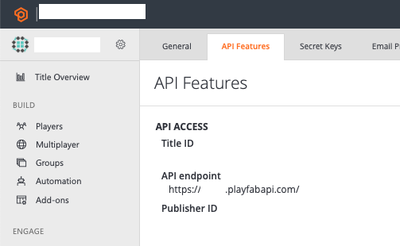
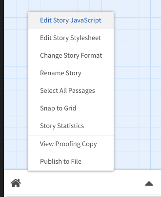

# PlayFab-Twine


PlayFab-Twine is a library that makes it easy to integrate [PlayFab](https://https://playfab.com) analytics into your [Twine](https://twinery.org) games. With only a few lines of copy/pasted code, you can get free real-time analytics about how players are interacting with your game or experience! It specifically targets games built in Twine 2 using the Harlowe story format.

You can find an interactive version of this README, written in Twine and displaying live stats via PlayFab-Twine, at https://lazerwalker.com/playfab-twine

## What is Twine?

[Twine](https://twinery.org) is a tool for making hypertext-based interactive fiction — text-based narrative games you play in a web browser by reading text and clicking on links! Twine has a user-friendly visual editor that makes it easy to make games even if you don't know how to program.

## What is PlayFab?

[PlayFab](https://playfab.com) is a hosted backend platform for game LiveOps. In plain English, that means it provides all of the server bits you need to run an online game: things like friend lists and voice chat, an in-game store and inventory management, and leaderboards.

If you're making a Twine game, most of this isn't relevant to you! However, it does include a very good analytics service. Because it's meant for games, it's a better fit fo Twine games than many other non-game analytics tools.

Its free tier is also very generous. If you're just using it to add analytics to your Twine game, it won't cost you anything!

## What is PlayFab-Twine?

PlayFab-Twine is a piece of software that makes it easy for you to add analytics to your Twine game without writing any custom code!

With only a few lines of copy/pasted code, and a tiny bit of configuration, it will automatically gather user behavior for you to look at later. It will:

- Track which nodes players visit, and in what order
- Track any number of Twine variables
- Give you the ability to easily show players choice graphs:

No identifying data is stored about your players, and their data will not be sold or used in any way.

## Getting Started

Getting started with PlayFab-Twine is easy!

You'll need to [[sign up for a free PlayFab account and get your Title ID|Sign up for PlayFab]].

If you already have that, you can jump straight to [[adding the library to your Twine game]].

::Sign up for PlayFab

1. Sign up for a PlayFab account at [https://playfab.com](https://playfab.com?WT.mc_id=github-playfabtwine-emwalker). Once you've created an account and a Studio, create a new Title (this represents a single game).

2. Find your PlayFab Title ID. You can find it by clicking the gear in the top-left corner, selecting "Title Settings", and going to the "API Features" tab. It should look something like "A1B2C3".




3. In the Twine editor, edit your game's JavaScript code by opening the menu and selecting "Edit Story JavaScript".



4. Paste in the following code, adding in the appropriate Title ID and variable names.

```js
var url = "https://lazerwalker.com/playfab-twine/index.js";

// Your PlayFab Title ID, found in Step 2
var playfabID = "A1B2C3";

// An array of every Twine variable you want to track (don't include the dollar sign)
var trackedVariables = ["score", "hunger", "hasPetDog"];

$(function() {
  $.getScript(url, function(data, textStatus, jqxhr) {
    const trackedVariables = [];
    setupPlayfab(playfabID, trackedVariables, State);
  });
});
```

...and that's it! As soon as your game is live on the web, you can log in at [https://playfab.com](https://playfab.com?WT.mc_id=github-playfabtwine-emwalker) and see real-time data flowing in.

## What Data Is Stored?

PlayFab-Twine hooks into Twine's runtime and sends off analytics events when the player does certain actions. All of this data is piped through to Playfab for you to peruse.

PlayFab-Twine exposes data in a few different ways:

### Tracking Link Clicks / Visited Nodes

Every time a player clicks a link, two events are tracked. One is called `link_clicked`, and one is called `link_clicked_{link text}`, where the `link text` is the full printed text that was displayed in the link, but with spaces replaced by underscores. Both have a JSON payload for their body:

```
{
    text: "", // The printed text of the link
    state: {} // An object containing key/value pairs of the current state of every tracked variable
}
```

The `state` object contains the current values for every variable key given in the `trackedVariables` argument passed into PlayFab-Twine when you initialize it.

Additionally, every time Harlowe loads a new node, an event is fired with the name `node_loaded`, with a payload similar to the previous events. The "text" property contains the internal name of the node, rather than the displayed text on the clicked link.

**WARNING**: This duplication isn't great! Cleaning this up will hopefully happen before this library is publicized.

### Tracking Game Close

When the player closes the browser window on a game using PlayFab-Twine, it attempts to fire off an analytics event called `game_closed`. Its body is the same as other events: `state` contains the current value of all tracked variables, and `text` contains the internal name of the passage the user was on when they exited.

### User Persistence

PlayFab-Twine generates a random unique identifier for each player, stores it in the browser's LocalStorage, and then uses it to identify the player within PlayFab. This mean that if someone plays the games multiple times from the same web browser, they will often (but not always) be identified as the same "player" within PlayFab's web UI, but that identity will not persist across different devices or different web browsers. In most cases, it is unlikely this will meaningfully affect your game's stats.

## How to Read Data on PlayFab

All of the base-level dashboard data PlayFab gives you (about daily active users, etc) should be accurate. TODO: Talk about exactly what that is.

TODO: Write about how to run analytics reports.

## How to Access Data Within Twine

This is not yet currently public, but I'm actively working on an API to access gamewide analytics data from within Twine. My intent is to provide an easy system for you to drop in a Telltale-style visualization of what percentage of players made similar choices to the active player. Stay tuned for more!

## Privacy

TODO: This section will talk, in human-readable terms, how PlayFab stores your data. For now, it's worth noting that this library doesn't store your data in any way, and does not access your PlayFab account in any way other than to upload data to it.

## License

MIT.
