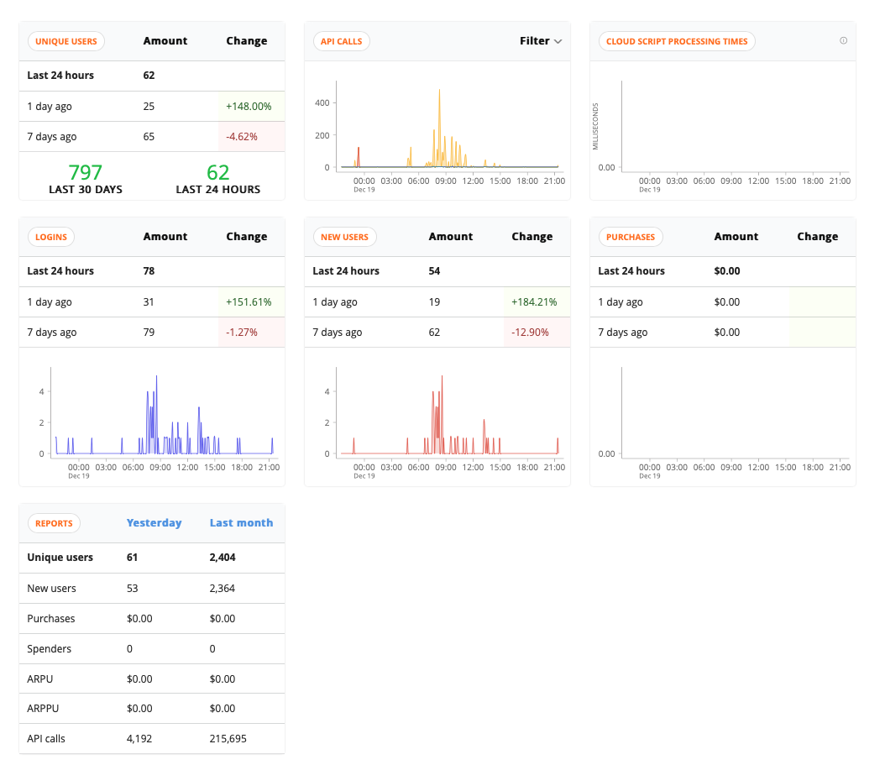
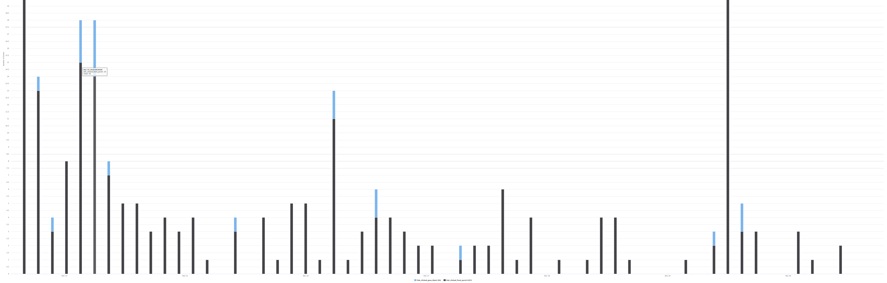

# PlayFab-Twine


PlayFab-Twine is a library that makes it easy to integrate [PlayFab](https://playfab.com?WT.mc_id=github-playfabtwine-emwalker) analytics into your [Twine](https://twinery.org) games. With only a few lines of copy/pasted code, you can get free real-time analytics about how players are interacting with your game or experience! It specifically targets games built in Twine 2 using the Harlowe story format.

**WARNING: This repo is under construction. Watch this space!**

You can (will be able to) find an interactive version of this README, written in Twine and displaying live stats via PlayFab-Twine, at https://lazerwalker.com/playfab-twine

## What is Twine?

[Twine](https://twinery.org) is a tool for making hypertext-based interactive fiction — text-based narrative games you play in a web browser by reading text and clicking on links! Twine has a user-friendly visual editor that makes it easy to make games even if you don't know how to program.

## What is PlayFab?

[PlayFab](https://playfab.com?WT.mc_id=github-playfabtwine-emwalker) is a hosted backend platform for game LiveOps. In plain English, that means it provides all of the server bits you need to run an online game: things like friend lists and voice chat, an in-game store and inventory management, and leaderboards.

If you're making a Twine game, most of this isn't relevant to you! However, it does include a very good analytics service. Because it's meant for games, it's a better fit fo Twine games than many other non-game analytics tools.

Its free tier is also very generous. If you're just using it to add analytics to your Twine game, it won't cost you anything!

## What is PlayFab-Twine?

PlayFab-Twine is a piece of software that makes it easy for you to add analytics to your Twine game without writing any custom code!

With only a few lines of copy/pasted code, and a tiny bit of configuration, it will automatically gather user behavior for you to look at later. It will:

- Track which passages players visit, and in what order
- Track any number of Twine variables

No identifying data is stored about your players, and their data will not be sold or used in any way.

## Getting Started

Getting started with PlayFab-Twine is easy!

You'll need to [[sign up for a free PlayFab account and get your Title ID|Sign up for PlayFab]].

If you already have that, you can jump straight to [[adding the library to your Twine game]].

::Sign up for PlayFab

1. Sign up for a PlayFab account at [https://playfab.com](https://playfab.com?WT.mc_id=github-playfabtwine-emwalker). Once you've created an account and a Studio, create a new Title (this represents a single game).

2. Find your PlayFab Title ID. You can find it by clicking the gear in the top-left corner, selecting "Title Settings", and going to the "API Features" tab. It should look something like "A1B2C3".


3. In the Twine editor, edit your game's JavaScript code by opening the menu and selecting "Edit Story JavaScript".


4. Paste in the following code, adding in the appropriate Title ID and variable names.

```js
var url = "https://lazerwalker.com/playfab-twine/index.js";

// Your PlayFab Title ID, found in Step 2
var playfabID = "A1B2C3";

// An array of every Twine variable you want to track (don't include the dollar sign)
var trackedVariables = ["score", "hunger", "hasPetDog"];

$(function() {
  $.getScript(url, function(data, textStatus, jqxhr) {
    const trackedVariables = [];
    setupPlayfab(playfabID, trackedVariables, State);
  });
});
```

...and that's it! As soon as your game is live on the web, you can log in at [https://playfab.com](https://playfab.com?WT.mc_id=github-playfabtwine-emwalker) and see real-time data flowing in.

## What Data Is Stored?

PlayFab-Twine hooks into Twine's runtime and sends off analytics events when the player does certain actions. All of this data is piped through to Playfab for you to peruse.

PlayFab-Twine exposes data in a few different ways:

### Tracking Link Clicks / Visited Passages

PlayFab-Twine sends analytics events in two instances: when the player clicks a link, and when the game engine loads a new passage.

Because Twine lets you have links that do not directly lead to new passages (e.g. reveal links, cycle links), that distinction is important.

When a new passage is loaded, an event titled `passage_loaded` is fired off. It contains two properties: the internal name of the new passage, and an object containing the current values of every variable you've said you want to track when you initialize PlayFab-Twine.

Similarly, whenever a link is clicked, a `link_clicked` event is fired, with `Text` and `State` values. `State` is the same as `passage_loaded`, whereas `Text` contains the displayed text on the link that was clicked.

**Technical note (feel free to ignore this if you're confused):** Current limitations of the PlayFab Analytics dashboard mean that PlayFab-Twine currently also sends a whole second set of events for each link click / passage load. If the player clicks a link titled "click me", a `link_clicked` event will be registered, but so will another one with the name `link_clicked_click_me`. It will have the same `Text` and `State` properties as the first one. Similarly, if a passage called "My Passage" is loaded, there will be both a normal `passage_loaded` event as well as one with the name `passage_loaded_my_passage`. More information on why this is, and how to use this, is available in the "How to Read Data on PlayFab" section below.

### Tracking Game Close

When the player closes the browser window on a game using PlayFab-Twine, it attempts to fire off an analytics event called `game_closed`. Its body is the same as other events: `State` contains the current value of all tracked variables, and `Text` contains the internal name of the passage the user was on when they exited.

### User Persistence

PlayFab-Twine generates a random unique identifier for each player, stores it in the browser's LocalStorage, and then uses it to identify the player within PlayFab. This mean that if someone plays the games multiple times from the same web browser, they will often (but not always) be identified as the same "player" within PlayFab's web UI, but that identity will not persist across different devices or different web browsers. In most cases, it is unlikely this will meaningfully affect your game's stats.

## How to Read Data on PlayFab

All of the base-level dashboard data PlayFab gives you (about daily active users, etc) should be accurate. TODO: Talk about exactly what that is.

### Core Game Health

On the front page of your PlayFab dashboard, you'll get live information about things like the number of daily active and monthly users.



You'll also get a version of this report emailed to you every day.

Additionally, the "PlayStream Monitor" tab will show you a real-time feed of your players interacting with your game!

### Analytics Reports

If you click the "Data" link in the "Analyze" subsection of the PlayFab dashboard, you can reach the Analytics dashboard, where you can run custom queries.

The [PlayFab documentation](https://docs.microsoft.com/en-ca/gaming/playfab/features/analytics/metrics/real-time-analytics-event-queries?WT.mc_id=github-playfabtwine-emwalker) has a great overview of the query language you can use to write your own custom queries.

Specifically, if you want to pull up specific events, you want to use the `EventData.EventName` field, and use the event names that include the passage or link text in them (see the technical note above).

As an example, this query will show every time a player either clicked a link titled "Go inside", or loaded a passage called "front porch":

`EventData.EventName == 'link_clicked_Go_inside' or EventData.EventName == 'passage_loaded_front_porch'`

Note that these titles are case-sensitive.

This will let you view a graph comparing relative popularities of those events over time:



(**Technical explanation**: Why do we need to use the ugly long event names instead of the more concise ones? The PlayFab analytics dashboard currently doesn't allow you to easily run reports that segregate data with the same event name based on custom event properties. In other words, you can say "give me every `passage_loaded` query where the passage name is one of these five passages", but the graph you see will group them all together instead of letting you break out data by passage.)

## Future Roadmap

Although tracked variables are currently being stored in PlayFab, and can be viewed in individual passage/link events, there's no way to visualize them en masse.I'm working on exploring the best way to do that with PlayFab's free tier, as a lot of the more complex analytics functionality is gated behind having a paid subscription.

I'm also trying to come up with a friendly way to expose analytics data to Twine games themselves. My hope is to find a way to let Twine designers easily drop in Telltale-style "X% of players made the same choice as you" graphs, but it's not yet clear to me if there's an easy way to do that without requiring gamemakers to write a lot of server code.

## Privacy

The basic concept of gathering user analytics can sometimes feel icky. A few specific points about PlayFab-Twine and privacy:

- This tool doesn't actually store or do anything with your data. It just writes it to your personal PlayFab account, and does not access your PlayFab account in any other way.
- By default, PlayFab doesn't gather any personally identifiable information (PII). Unless you're doing something pretty weird with your game, neither PlayFab nor you will be able to link an anonymous player account to a real human being based purely on their behavioral data. By default, it doesn't even store IP addresses.
- PlayFab will not sell or reuse your private user data (at least at the time of this writing, I am not a lawyer, etc). See PlayFab's [Terms of Service](https://playfab.com/terms/) for more information.
- As long as you're on a free PlayFab tier, data is only retained for 7 days.

## License

MIT.
